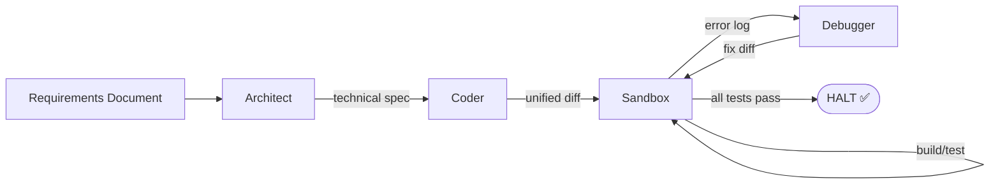
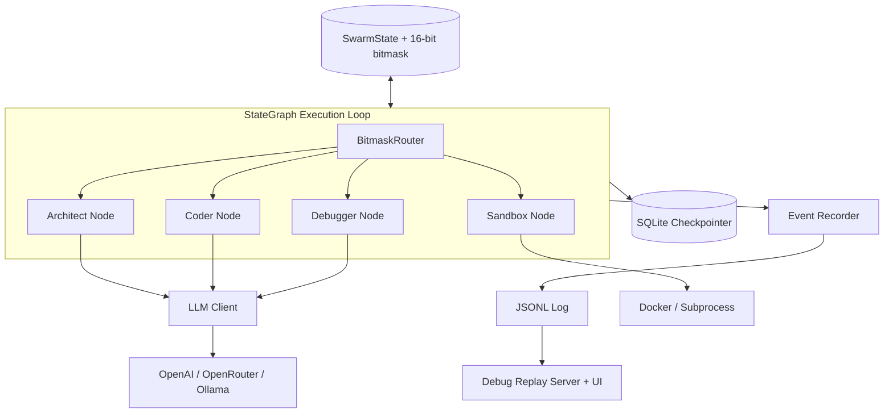

# SophronSwarm

**A token-efficient, bitmask-coordinated multi-agent platform for autonomous software engineering.**

SophronSwarm orchestrates a swarm of specialised AI agents that collaborate to take a plain-text requirements document and produce a working, built, and tested software project — entirely autonomously. Coordination between agents is achieved through a single 16-bit bitmask and a purely declarative routing table, so **no LLM tokens are ever spent deciding which agent runs next**. A local zero-token sandbox handles all compilation, testing, and patch application.

---

## Table of Contents

- [How It Works](#how-it-works)
- [Key Features](#key-features)
- [Architecture](#architecture)
- [Project Structure](#project-structure)
- [The 16-bit Bitmask Protocol](#the-16-bit-bitmask-protocol)
- [Agent Nodes](#agent-nodes)
- [Core Subsystems](#core-subsystems)
- [Installation](#installation)
- [Configuration](#configuration)
- [Usage](#usage)
- [Debug & Replay UI](#debug--replay-ui)
- [Error Handling & Loop Protection](#error-handling--loop-protection)
- [Supported Languages](#supported-languages)

---

## How It Works



1. The **Architect** reads the requirements and autonomously chooses a language stack and scaffold, emitting a technical spec.
2. The **Coder** implements the spec as a single unified diff (new files are created from `/dev/null`).
3. The **Sandbox** (zero LLM tokens) applies the patch, then runs build and test commands inside Docker.
4. On failure, the **Debugger** reads a purified error log and produces a minimal corrective diff.
5. The loop continues until all tests pass (HALT) or a safety limit trips.

Routing between these nodes is **deterministic bitmask arithmetic** — never an LLM call.

---

## Key Features

- **🧠 Bitmask-coordinated swarm** — All inter-agent coordination lives in one 16-bit integer (language · action · status flags · node ID). Routing is pure bitwise evaluation against a declarative JSON table.
- **🚫 Zero-token sandbox** — Patch application, compilation, and testing run entirely in-process / Docker. No cloud API calls for execution.
- **🔀 Provider-agnostic LLM layer** — Works with any OpenAI-compatible endpoint (OpenAI, Azure, Ollama, vLLM) and has a first-class OpenRouter client with fallbacks, telemetry, streaming, and tool-call callbacks.
- **💸 Prompt-cache-optimised prompts** — Messages are ordered by volatility (stable system + requirements prefix, volatile tail) to maximise provider prefix-cache hits.
- **🔄 Resilient by design** — Transient errors (timeouts, 429s, 5xx) are retried with exponential backoff; fatal errors halt cleanly. Checkpointer failures degrade to no-ops.
- **♻️ Immutable SQLite checkpointer** — Every state transition is appended to an append-only audit log, enabling rollback to any prior snapshot.
- **🔎 Built-in debug replay UI** — Every LLM call, node transition, bitmask change, and sandbox result is recorded to JSONL and viewable in a live web UI.
- **🛡️ Infinite-loop protection** — A `failure_streak` counter trips `FLAG_MUTATION` and halts after 5 consecutive failed patches, protecting your API budget.
- **🧹 Log purification** — Raw build/test output is stripped of ANSI codes and distilled to language-specific error blocks before being sent to the Debugger.

---

## Architecture



### Design Principles

- **Agents are isolated transformation functions.** Each node reads `SwarmState` and returns a new `SwarmState`. Direct agent-to-agent communication is prohibited.
- **Routing is declarative.** No hardcoded edges — the topology lives entirely in `config/routing_table.json`.
- **High-volatility data is ephemeral.** `shared_payload` carries single-turn context between adjacent nodes; the workspace tree is metadata-only (no file contents).

---

## Project Structure

```
SophronSwarm/
├── main.py                          # CLI entry point: builds graph, launches a task
├── requirements.txt                 # Python dependencies
├── config/
│   └── routing_table.json           # Declarative bitmask routing rules
├── debug_runs/                      # JSONL event logs (auto-generated)
│   └── events_YYYYMMDD_HHMMSS.jsonl
└── sophron_swarm/
    ├── __init__.py                  # Public API exports
    ├── state.py                     # SwarmState + BitMask (16-bit coordination)
    ├── graph.py                     # StateGraph execution loop
    ├── router.py                    # BitmaskRouter (pure bitwise routing)
    ├── checkpointer.py              # SQLite append-only state log
    ├── recorder.py                  # JSONL event recorder (singleton)
    ├── debug_server.py              # HTTP server for replay UI
    ├── log_purifier.py              # Build/test output purification
    ├── prompt_builder.py            # Cache-optimised prompt assembly
    ├── llm_client.py                # LLMClient ABC + OpenAI/OpenRouter clients
    ├── workspace.py                 # Lazy file access + path-traversal guard
    ├── retry.py                     # Transient-error classifier + retry helpers
    ├── debug_ui/
    │   └── index.html               # Dark-themed replay UI (live polling)
    └── nodes/
        ├── __init__.py
        ├── architect.py             # Frontier model: design + language choice
        ├── coder.py                 # Code model: emits unified diffs
        ├── sandbox.py               # Zero-token: patch + Docker build/test
        └── debugger.py             # Mid-tier model: error analysis + fix diff
```

---

## The 16-bit Bitmask Protocol

All coordination state is packed into a single unsigned 16-bit integer, segmented into four nibbles:

```
┌─────────────────┬───────────────────┬────────────────────┬─────────────────┐
│ Bits 15-12      │ Bits 11-8         │ Bits 7-4           │ Bits 3-0        │
│ Target Language │ Requested Action  │ Error/Status Flags │ Active Node ID  │
└─────────────────┴───────────────────┴────────────────────┴─────────────────┘
```

| Segment | Bits | Values |
|---------|------|--------|
| **Language** | 15-12 | `0` shell · `1` python · `2` nodejs · `3` rust · `4` go · `5` cpp |
| **Action** | 11-8 | `0` idle · `1` scaffold · `2` install_deps · `3` build · `4` test · `5` patch |
| **Flags** | 7-4 | bit7 `HALT` · bit6 `TEST_FAIL` · bit5 `BUILD_ERR` · bit4 `MUTATION` |
| **Node ID** | 3-0 | `1` architect · `2` coder · `3` sandbox · `4` debugger |

The `BitmaskRouter` evaluates rules in priority order using a single operation:
`next_node = rule.target_node  if  (bitmask & rule.mask) == rule.value`. The first match wins.

Example: a bitmask of `0x2503` decodes to **nodejs · patch · sandbox**.

---

## Agent Nodes

### 🏛️ Architect (`nodes/architect.py`)
- Analyses requirements + workspace tree and **autonomously selects the language ecosystem**.
- Emits a structured technical specification into `shared_payload` for the Coder.
- Sets `ACTION_SCAFFOLD` and routes to the Coder.

### 💻 Coder (`nodes/coder.py`)
- Implements the Architect's spec **exclusively as unified diffs** (never rewrites whole files).
- Creates new files from `/dev/null`; concatenates multi-file diffs into one `shared_payload`.
- Sets `ACTION_PATCH` and routes to the Sandbox.

### ⚙️ Sandbox (`nodes/sandbox.py`) — *Zero LLM tokens*
- Applies patches via a robust Python applier (handles LLM-emitted diffs with incorrect hunk counts) with a POSIX `patch` fallback (`-p1` then `-p0`).
- Runs language-specific build/test/scaffold commands inside **Docker containers** (auto-pulls missing images), with a **subprocess fallback** for Dockerless environments.
- Translates exit codes directly into bitmask flags — no text sent to any cloud model.

### 🐛 Debugger (`nodes/debugger.py`)
- Triggered only when `BUILD_ERR` or `TEST_FAIL` is set.
- Reads the *purified* error log and produces a minimal corrective unified diff.
- Clears error flags on analysis; increments `failure_streak` for loop protection.

---

## Core Subsystems

### StateGraph (`graph.py`)
The async execution loop. Each iteration: route → execute node → materialise dirs → serve requested files (with auto-stay) → checkpoint → check HALT. Hard-capped at `MAX_ITERATIONS = 64`.

### BitmaskRouter (`router.py`)
Declarative, priority-ordered rule evaluation. Rules load from JSON or inline. The `HALT` flag hard-wires unconditional termination.

### Checkpointer (`checkpointer.py`)
Thread-safe, WAL-mode SQLite append-only log. One connection per thread. `save()` / `load_latest()` / `load_at(seq)` enable granular rollback. All failures degrade to no-ops.

### Event Recorder (`recorder.py`)
Module-level singleton that captures every LLM request/response, node enter/exit (with state diffs), bitmask transitions, and sandbox dispatches to a timestamped JSONL file. Flushed after every event for live inspection.

### Prompt Builder (`prompt_builder.py`)
Assembles messages in volatility order (static system → immutable requirements → volatile iteration context) to maximise cloud prefix-cache efficiency. Parses agent JSON responses (tolerates markdown fences).

### Workspace Manager (`workspace.py`)
Implements **on-demand file access**: agents see only the structural tree, and file contents are served ephemerally on request for a single turn. Enforces path-traversal safety, strips leading slashes, and returns explicit `(file does not exist on disk)` markers for missing files.

### Log Purifier (`log_purifier.py`)
Strips ANSI/terminal formatting, then extracts language-specific error blocks (Rust `error[E]`, Python tracebacks, Node `TypeError`, Go `file:line:col`, C++ compiler errors). Falls back to the last 15 lines for unknown formats.

### Retry (`retry.py`)
`is_transient_error()` classifies timeouts, connection resets, 429s, and 5xx as retriable. `async_retry` decorator and `retry_sync` helper apply exponential backoff with jitter (3 retries, base 2s, max 30s).

### LLM Clients (`llm_client.py`)
- **`LLMClient`** — abstract base interface all nodes depend on.
- **`OpenAICompatibleClient`** — works with OpenAI, Azure, Ollama, vLLM, LM Studio.
- **`OpenRouterClient`** — adds fallback models, provider preferences, prompt transforms, plugins, reasoning-effort control, data-collection policy, streaming, tool-call callbacks, and cost/latency telemetry.

---

## Installation

**Requirements:** Python 3.11+, Docker (optional, for sandboxed execution).

```bash
git clone <repo-url> SophronSwarm
cd SophronSwarm
pip install -r requirements.txt
```

Dependencies:

| Package | Purpose |
|---------|---------|
| `pydantic>=2.0.0` | `SwarmState` schema validation |
| `docker>=7.0.0` | Sandbox container execution |
| `openai>=1.0.0` | Async LLM client (any OpenAI-compatible endpoint) |
| `python-dotenv` | Loading `.env` credentials |

---

## Configuration

SophronSwarm is configured via environment variables (loadable from a `.env` file):

| Variable | Default | Description |
|----------|---------|-------------|
| `OPENROUTER_API_KEY` | *(required)* | API key for the OpenRouter provider |
| `OPENAI_API_KEY` | *(optional)* | API key if using `OpenAICompatibleClient` directly |
| `SOPHRON_WORKSPACE` | `~/sophron_workspace` | Local workspace directory for generated projects |
| `SOPHRON_ARCHITECT_MODEL` | `deepseek/deepseek-v4-flash` | Model for the Architect agent |
| `SOPHRON_CODER_MODEL` | `deepseek/deepseek-v4-flash` | Model for the Coder agent |
| `SOPHRON_DEBUGGER_MODEL` | `deepseek/deepseek-v4-flash` | Model for the Debugger agent |
| `SOPHRON_DEBUG_PORT` | `8877` | Port for the debug replay UI |

> **Note:** The target programming language is **not** configured — the Architect agent selects it autonomously based on the requirements.

### Routing Table (`config/routing_table.json`)

The declarative routing table defines which node handles each bitmask state. Rules are evaluated top-to-bottom; the first match wins. Edit this file to change the swarm's topology without touching code.

---

## Usage

### Run a task

Edit the `requirements_doc` in `main.py` (or wire up your own input), then:

```bash
export OPENROUTER_API_KEY="your-key-here"
python main.py
```

Generated files are written to `$SOPHRON_WORKSPACE`. A debug replay UI starts automatically at `http://localhost:8877`.

### Programmatic API

```python
import asyncio
from sophron_swarm import StateGraph, SwarmState, BitMask, BitmaskRouter, Checkpointer
from sophron_swarm.llm_client import OpenAICompatibleClient
from sophron_swarm.nodes.architect import architect_node
from sophron_swarm.nodes.coder import coder_node
from sophron_swarm.nodes.debugger import debugger_node
from sophron_swarm.nodes.sandbox import sandbox_node

async def main():
    llm = OpenAICompatibleClient(model="gpt-4o", api_key="sk-...")
    graph = StateGraph(checkpointer=Checkpointer(), router=BitmaskRouter())

    async def _architect(state): return await architect_node(state, llm)
    async def _coder(state):     return await coder_node(state, llm)
    async def _debugger(state):  return await debugger_node(state, llm)

    graph.register_node("architect", _architect)
    graph.register_node("coder",     _coder)
    graph.register_node("sandbox",   sandbox_node)
    graph.register_node("debugger",  _debugger)
    graph.load_routing_from_file("config/routing_table.json")
    graph.compile()

    state = SwarmState(
        bitmask=BitMask.ACTION_SCAFFOLD | BitMask.NODE_ARCHITECT,
        project_requirements="Build a REST API in Python...",
        workspace_root="/tmp/myproject",
    )
    await graph.run(state, thread_id="my-task")

asyncio.run(main())
```

---

## Debug & Replay UI

Every run emits a JSONL event log to `debug_runs/events_YYYYMMDD_HHMMSS.jsonl`. A built-in HTTP server serves a dark-themed replay UI for inspecting:

- Full LLM request/response payloads per node
- Node enter/exit transitions with before/after state diffs
- Bitmask transitions (hex + decoded)
- Sandbox dispatch results (patch/build/test outcomes)
- Live polling for in-progress runs

**Start standalone:**

```bash
python -m sophron_swarm.debug_server                              # latest run
python -m sophron_swarm.debug_server ./debug_runs/events_X.jsonl  # specific run
python -m sophron_swarm.debug_server --port 8080 --no-browser     # custom port
```

---

## Error Handling & Loop Protection

| Mechanism | Behaviour |
|-----------|-----------|
| **Transient error retry** | Timeouts, 429s, 5xx retried 3× with exponential backoff before halting. |
| **Fatal error** | Non-transient exceptions trip `FLAG_HALT` immediately. |
| **MUTATION flag** | After 5 consecutive failed patches (`failure_streak`), `FLAG_MUTATION` trips and halts to protect API spend. |
| **MAX_ITERATIONS** | Hard cap of 64 iterations prevents runaway billing. |
| **File-request stay cap** | A node may auto-stay to process requested files at most 3 times before being forced to proceed (prevents infinite re-requests of non-existent files). |
| **Checkpoint safety** | All DB operations are wrapped in try/except — persistence failures degrade to no-ops, never crashing the loop. |

---

## Supported Languages

The Sandbox ships with Docker images, build, test, and scaffold commands for:

| Language | Docker Image | Build | Test |
|----------|-------------|-------|------|
| Shell/Bash | `ubuntu:22.04` | `bash -n` | `bash -n` |
| Python | `python:3.11-slim` | `py_compile` | `pytest` |
| Node.js | `node:20-alpine` | `npm run build` | `npm test` |
| Rust | `rust:1.78-slim` | `cargo build` | `cargo test` |
| Go | `golang:1.22-alpine` | `go build` | `go test` |
| C++ | `gcc:13` | `g++` | `ctest` |

Add new languages by extending the `_DOCKER_IMAGES`, `_BUILD_COMMANDS`, `_TEST_COMMANDS`, and `_SCAFFOLD_COMMANDS` dictionaries in `nodes/sandbox.py`, plus the `LANG_*` constants in `state.py`.

---

*SophronSwarm v2.0.0 — Token-Efficient Multi-Agent Platform.*
