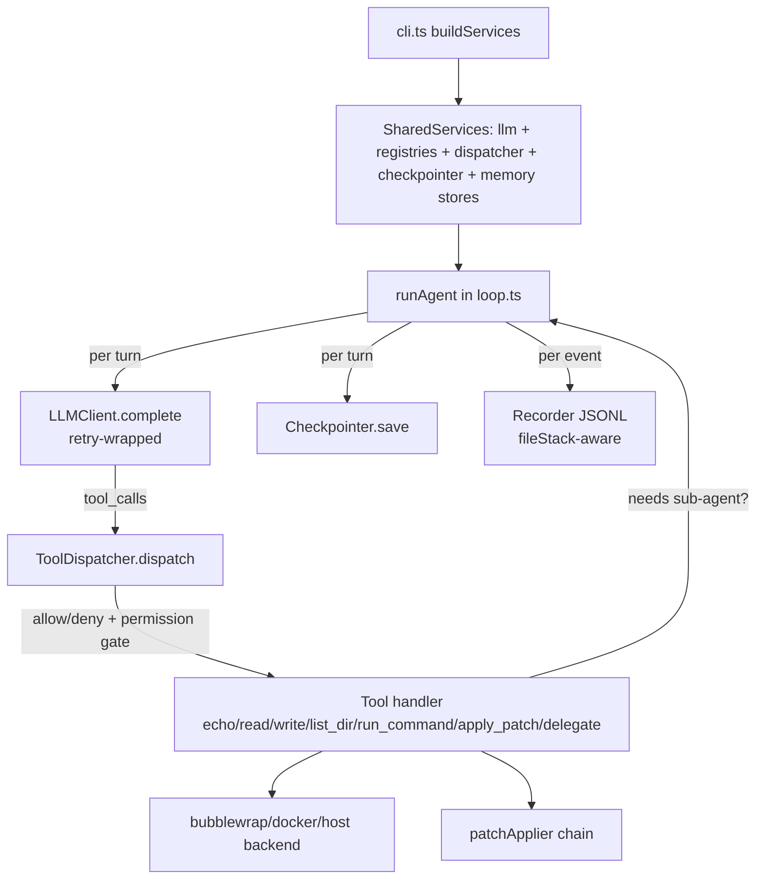

# SophronSwarm V3 — Agent Context Prompt

> **Purpose:** A self-contained brief that gives another AI agent full context to continue developing SophronSwarm V3. Read this top to bottom before writing any code.
>
> **Last updated:** 2026-07-05
> **Current state:** Phases 0, 1, 2, 3 complete (200/200 tests passing, clean `tsc`). Phase 4 (MCP) is next.

---

## 0. TL;DR — What this project is

**SophronSwarm V3** is a modular, token-optimized, multi-agent CLI for autonomous software engineering at the organization level. It evolved from V2 (a Python bitmask-coordinated pipeline at `/home/monsterv82152/Workspace/AI/SophronSwarm/V2`) into a **dynamic organization of highly-specialized agents that delegate work to each other**, like a real engineering org.

**The guiding principle:** spend tokens only where an LLM's judgment is required. Everything else — routing, file I/O, builds, tests, patching, sandboxing — is deterministic machinery.

**Stack:** TypeScript (strict), Node 22+. V2 (Python) is the *reference spec*; logic ports 1:1, code does not.

**Project root:** `/home/monsterv82152/Workspace/AI/SophronSwarm/V3`

---

## 1. Locked architectural decisions (do not relitigate)

| Area | Decision | Rationale |
|---|---|---|
| **Language** | TypeScript, not Python | Front-end strength, one language (CLI+TUI+web), MCP first-class in TS, SwarmClaw validates the stack |
| **Coordination** | Agent-initiated **delegation + declarative policy** | V2's 16-bit bitmask was token-free but rigid (5 hardcoded nodes); delegation is unbounded at near-zero cost |
| **Providers** | OpenRouter + Ollama + z.ai (all OpenAI-compatible → one client) | z.ai base URL: `https://api.z.ai/api/coding/paas/v4` |
| **Sandbox** | **bubblewrap (bwrap) primary**, Docker opt-in, host gated (`SOPHRON_ALLOW_HOST_BACKEND=1`) | bwrap is on Ubuntu, microsecond startup, accepts arbitrary commands; Landlock securityfs isn't mounted on this host |
| **Patch applier** | V2 chain ported: TS applier → `patch -p1` → `patch -p0` | Survives messy model output (prose-as-diff, wrong hunk counts, bare paths) |
| **Memory (shared)** | Plain markdown under `<workspace>/.sophron/shared/` | Diffs in git, operator-editable, no DB/vector store |
| **Memory (per-agent)** | `<memory_root>/<agent_id>/MEMORY.md`, first ~200 lines auto-injected | Quality-gated, deduped reflection writes |
| **Memory (task)** | Ephemeral transcript, dies with the task | Promote only via `remember` tool or handoff packets |
| **Agent creation** | One-time bootstrap; architect drafts full roster; ALL drafts require operator approval; then closed | Prevents uncontrolled self-modifying swarms |
| **MCP** | Lazy by default (`alwaysExpose:false`) + `mcp_tool_search` meta-tool | MCP token sprawl is the silent budget killer |
| **Agent soft cap** | Warn (don't block) at >12 agents per workspace | Keeps org chart navigable |
| **Auto-mode classifier** | Small local Ollama model for per-command vetting | Free, offline, low-latency |
| **Roster shape** | `model: ollama:qwen3.5:9b-thinking` is available locally | Used for all demo agents |

---

## 2. Codebase map (current)

```
V3/
├── docs/                    # All design + completion docs (read these!)
│   ├── PROJECT_OVERVIEW.md  # Master spec — all features, decisions, phasing
│   ├── PHASE_0_DESIGN.md / PHASE_0_COMPLETE.md
│   ├── PHASE_1_DESIGN.md / PHASE_1_COMPLETE.md
│   └── PHASE_2_DESIGN.md / PHASE_2_COMPLETE.md
├── agents/                  # Project-level agent definitions (.md + YAML frontmatter)
│   ├── echo-bot.md          # trivial test agent
│   ├── builder.md           # Phase 1 demo (scaffolds + runs node under bubblewrap)
│   └── orchestrator.md      # Phase 2 demo (delegates to echo-bot)
├── src/
│   ├── index.ts             # CLI entry
│   ├── cli.ts               # commander subcommands: run / agents / replay
│   ├── types.ts             # Core types (AgentDefinition, AgentRunState, LLMMessage, ToolCall/Result, Usage, DelegationContext, HandoffPacket)
│   ├── agent/
│   │   ├── loader.ts        # gray-matter + zod → AgentDefinition; resolves model tier ONCE at load
│   │   ├── registry.ts      # indexed collection + chokidar hot-reload + 12-agent soft cap
│   │   ├── loop.ts          # THE AGENTIC LOOP (the heart) — pulls memory from services into prompt
│   │   └── delegation.ts    # checkPolicy (depth+cycle+allowlist), buildChildCtx, buildHandoffPacket, formatHandoffPacket
│   ├── memory/              # Phase 3 — three-tier memory layer
│   │   ├── sections.ts      # ## -section parse/serialize/edit + dedup helpers (shared by both stores)
│   │   ├── sharedStore.ts   # .sophron/shared/*.md (file + section level, toInjectionMap)
│   │   ├── agentStore.ts    # .sophron/memory/<id>/MEMORY.md (quality-gated append + 200-line inject)
│   │   └── checkpoints.ts   # parseCheckpoints + CheckpointManager.advance()
│   ├── llm/
│   │   ├── providers.ts     # OpenRouter/Ollama/z.ai config + resolveModel()
│   │   ├── client.ts        # one OpenAI-compat client; retry-controlled (timeout=120, maxRetries=0)
│   │   └── promptBuilder.ts # volatility-ordered messages for prefix-cache hits; injects per-agent + shared memory
│   ├── tools/
│   │   ├── schema.ts        # ToolSpec, ToolContext (+ SharedServices incl. memory stores), ToolHandler
│   │   ├── registry.ts      # ToolRegistry + definitionsFor (allow/deny filter)
│   │   ├── dispatcher.ts    # ToolDispatcher + PermissionGate (tool+mode-aware)
│   │   └── builtin/
│   │       ├── paths.ts           # safeResolve (path-traversal guard)
│   │       ├── index.ts           # registers all 9 built-in tools
│   │       ├── echo.ts, read_file.ts, write_file.ts, list_dir.ts  (in index.ts)
│   │       ├── run_command.ts     # shell under sandbox + dangerous-command blocker
│   │       ├── apply_patch.ts     # unified-diff applier
│   │       ├── delegate.ts        # spawn isolated sub-agent; persists handoff to shared memory
│   │       ├── remember.ts        # write to per-agent or shared memory (Phase 3)
│   │       └── advance_checkpoint.ts  # mark current milestone done, advance (Phase 3)
│   ├── sandbox/
│   │   ├── backend.ts             # ExecutionBackend interface + getBackend() factory
│   │   ├── spawn.ts               # spawnWithTimeout (AbortController + settled flag)
│   │   ├── bubblewrap.ts          # PRIMARY: bwrap namespace isolation
│   │   ├── docker.ts              # OPT-IN: container isolation
│   │   ├── host.ts                # GATED fallback (SOPHRON_ALLOW_HOST_BACKEND=1)
│   │   ├── dangerousCommands.ts   # 13 blocklist + 6 heuristic rules
│   │   └── patchApplier.ts        # V2 chain: TS applier → patch -p1 → patch -p0
│   ├── state/
│   │   ├── checkpointer.ts        # better-sqlite3, WAL, append-only, fileStack-aware
│   │   └── recorder.ts            # JSONL singleton with file-path STACK (nested-run safe)
│   └── util/
│       ├── log.ts                 # pino (pretty in dev)
│       ├── tokenize.ts            # approxTokens (chars/3.5)
│       └── retry.ts               # isTransientError + retryTransient (backoff + jitter)
├── tests/                   # 14 suites, 200 tests, all passing
│   ├── util/retry.test.ts                       (9)
│   ├── state/checkpointer.test.ts               (7)
│   ├── tools/dispatcher.test.ts                 (11)
│   ├── memory/sections.test.ts                   (20)
│   ├── memory/sharedStore.test.ts                (13)
│   ├── memory/agentStore.test.ts                 (14)
│   ├── memory/checkpoints.test.ts                (14)
│   ├── tools/memoryTools.test.ts                 (8)
│   ├── llm/promptBuilderMemory.test.ts           (5)
│   ├── agent/loader.test.ts                     (7)
│   ├── sandbox/dangerousCommands.test.ts        (55)
│   ├── sandbox/patchApplier.test.ts             (10)
│   ├── sandbox/bubblewrap.test.ts               (7, live)
│   └── agent/delegation.test.ts                 (20)
├── scripts/                 # verify-checkpoints.ts, list-checkpoints.ts (debugging helpers)
├── package.json, tsconfig.json (strict), .gitignore, .env.example
└── runs/ , .sophron/        # gitignored runtime state (JSONL logs, checkpoint.db)
```

**Commands:**
- `npm run dev -- run <agent> "<task>"` — run an agent
- `npm run dev -- agents` — list loaded agents
- `npm run dev -- replay <runId>` — print a run's JSONL events
- `npm test` — vitest (200 tests)
- `npm run typecheck` — `tsc --noEmit`

---

## 3. Phase-by-phase detail

### Phase 0 — Skeleton (✅ COMPLETE)
**Goal:** minimal but real foundation — agentic loop + tool dispatcher + declarative agent loader + LLM client + checkpointer + recorder.
**What it delivered:** define an agent as `.md`, load it, run its loop against any provider, call stub tools, persist state to SQLite, replay events from JSONL.
**Key files:** `agent/{loader,registry,loop}.ts`, `llm/{providers,client,promptBuilder}.ts`, `state/{checkpointer,recorder}.ts`, `tools/{schema,registry,dispatcher}.ts`, `util/retry.ts`.
**Gotchas:**
- Model resolution happens **once at agent-load time** → loader stores BOTH `model` (concrete id) AND `provider` on `AgentDefinition`. Client uses `agent.provider`, never re-resolves.
- Checkpoints keyed by `threadId`, not `runId` (both UUIDs). `replay` takes a runId.
- Test env must set `OLLAMA_DEFAULT_MODEL` so `model: inherit` resolves.
- OpenAI SDK tools need a cast: `tools as unknown as ChatCompletionTool[]`.
- chokidar: `import chokidar, { type FSWatcher }` (named export, not namespace).

### Phase 1 — Live Tools + Sandbox (✅ COMPLETE)
**Goal:** make the skeleton able to actually build code. Agents gain `run_command` (under bubblewrap + dangerous-command blocker) and `apply_patch` (V2's diff applier).
**What it delivered:** an agent can scaffold a project, edit files, run builds/tests, read errors, iterate — zero LLM tokens spent on execution.
**Key files:** `sandbox/{backend,spawn,bubblewrap,docker,host,dangerousCommands,patchApplier}.ts`, `tools/builtin/{run_command,apply_patch}.ts`.
**Permission routing:** `plan` denies mutations; other modes allow (blocker handles safety inside `run_command`).
**Gotchas:**
- bwrap `--tmpfs /tmp` masks workspaces under `/tmp` → use `--bind-try /tmp /tmp` + skip parent ro-bind when workspace is under `/tmp`.
- bwrap mount order is load-bearing: ro parent bind BEFORE rw workspace bind.
- Operator toolchains live under `$HOME` (node at `~/.local/bin/node`). Must bind `$HOME` read-only + pass `PATH` through, or node/cargo/etc. not found.
- AbortController timeout: set `timedOut` synchronously + use a `settled` flag (abort listener and `close` event race).
- Regex `\b` after `/` (non-word char) fails at end-of-string → classifier uses predicate functions for fs-destruction rules.

### Phase 2 — Delegation (✅ COMPLETE)
**Goal:** turn independent agents into a true multi-agent organization. Agents gain a `delegate` tool that spawns a sub-agent in its own isolated context window. Sub-agent's verbose output never enters the parent — only a concise HandoffPacket returns.
**What it delivered:** an orchestrator can decompose work across specialists while keeping its own context tight.
**Key files:** `agent/delegation.ts`, `tools/builtin/delegate.ts`. Changed: `types.ts` (DelegationContext, HandoffPacket), `tools/schema.ts` (SharedServices), `tools/dispatcher.ts` (threads services), `agent/loop.ts` (delegationCtx + services + recorder.closeRun), `state/recorder.ts` (file-path stack), `cli.ts` (buildServices once).
**Policy guards (in order):** depth limit (5) → cycle detection (ancestry) → allowlist (`delegateAllowlist`).
**Gotchas:**
- Recorder singleton + recursive `runAgent`: sub-agent's `openForRun()` overwrote parent's JSONL path. Fixed with file-path stack (`fileStack`, `closeRun()`). **Phase 2.5 parallel fan-out will need per-run recorder instances.**
- `delegateAllowlist: []` means "no restriction" (any target), NOT "nothing allowed".
- qwen3.5:9b-thinking sometimes burns all maxTurns on reasoning without calling `delegate`. Demos must be explicit: "use the delegate tool to…".
- `filesChanged` extraction is heuristic (scans `write_file`/`apply_patch`); misses files created via `run_command` (`touch foo.ts`).

---

## 4. How the system fits together (the stable spine)



**Invariants that must not break:**
- `maxTurns` cap = infinite-loop protection.
- Retry wraps ONLY the LLM call (transient → backoff, fatal → throw). Tool errors are returned to the model as `isError`, never retried, never fatal.
- Checkpoint after every turn → enables rewind (Phase 5).
- The agent loop, the dispatcher, the ToolSpec contract, and SharedServices are the stable spine.

---

## 5. What was built — Phase 3: Memory (✅ COMPLETE)

**Goal:** agents accumulate project knowledge across sessions; critical info survives task boundaries without re-derivation. **Status: DONE** — 200/200 tests, live demo confirmed cross-run recall. See [`PHASE_3_COMPLETE.md`](./PHASE_3_COMPLETE.md).

**Three memory tiers (all decided):**

1. **Per-agent memory** — `<memory_root>/<agent_id>/MEMORY.md`. Structured sections: Past Points of Failure, Past Encountered Issues, Key Points. First ~200 lines auto-injected into the system prompt. Writes via a `remember` tool (agent calls deliberately — NOT auto-dumped). Quality-gated (`reflectionMinQuality`) + optional embedding dedup.

2. **Shared memory** — plain markdown under `<workspace>/.sophron/shared/`:
   - `OVERVIEW.md` — high-level goal, stack, constraints
   - `CHECKPOINTS.md` — ordered milestones
   - `CURRENT_CHECKPOINT.md` — the single active milestone (drives the orchestrator)
   - **The current checkpoint lives in shared memory as a file** (not checkpointer state).

3. **Task memory** — ephemeral transcript, dies with the task. Promote via `remember` (→ per-agent or shared) or handoff packets (→ caller).

**Build order (executed — all steps done):**
1. ✅ `SharedServices` extension: `sharedMemoryStore` + `agentMemoryStore` added.
2. ✅ `src/memory/sections.ts` — shared `## `-section parse/serialize/edit + dedup helpers.
3. ✅ `src/memory/sharedStore.ts` — read/write `.sophron/shared/*.md` at file + section level; `toInjectionMap()`.
4. ✅ `src/memory/agentStore.ts` — `<memory_root>/<id>/MEMORY.md`; quality-gated append + 200-line inject.
5. ✅ `remember` tool — writes to per-agent or shared memory (agent picks scope; section aliases).
6. ✅ Prompt builder integration — injects per-agent ("YOUR PAST MEMORY") + shared ("SHARED PROJECT CONTEXT").
7. ✅ Handoff packets → shared memory (`HANDOFFS.md`, capped at 20 entries).
8. ✅ `advance_checkpoint` tool + `src/memory/checkpoints.ts` — mark current done, advance `CURRENT_CHECKPOINT.md`.
9. ✅ Tests (74 new across 6 files) + `rememberer` demo agent (verified cross-run recall live).

**Stable contracts Phase 4 builds on (now in place):**
- `SharedServices` is the single DI object — Phase 4 adds MCP registry/pool here.
- `ToolSpec` + `ToolRegistry` — lazy-loaded MCP tools register as `ToolSpec`s.
- `util/tokenize.ts` `approxTokens` (chars/3.5) — reusable for MCP tool-schema cost meter.

**What Phase 3 explicitly defers:** vector DB / embeddings (only when volume justifies), full reflection consolidation cycles (Phase 3.5), memory browser UI (Phase 5).

---

## 6. Conventions to follow

- **TypeScript strict**, ESM, `.js` import extensions in source (NodeNext resolution).
- **Never edit a file you don't understand** — read it first.
- **Test every step** — vitest, follow the existing test style (describe/it, `mkdtempSync` for fs tests).
- **Run `npm run typecheck` and `npm test` before declaring a step done.**
- **Port V2 logic 1:1 where it exists**, but as idiomatic TS (V2 is at `/home/monsterv82152/Workspace/AI/SophronSwarm/V2`).
- **Agent definitions are `.md` + YAML frontmatter** in `agents/` (project) or `~/.sophron/agents/` (user). Hot-reloaded via chokidar.
- **Tools are `ToolSpec`s** registered in `src/tools/builtin/index.ts`. The dispatcher handles allow/deny + permission gating; the dangerous-command blocker runs INSIDE `run_command`.
- **Don't create markdown docs unless asked** (per project convention).
- **Don't relitigate locked decisions** (§1).

---

## 7. First message to send the next agent

> "Continue SophronSwarm V3 development at Phase 4 (MCP). Read `docs/AGENT_CONTEXT.md` first, then `docs/PHASE_3_COMPLETE.md` for the handoff. The memory layer is complete (200/200 tests); Phase 4 builds the lazy MCP loader + `mcp_tool_search` meta-tool + token-cost meter + connection pool on top of the existing `SharedServices` DI object and `ToolSpec`/`ToolRegistry` contract. Run `npm test` to confirm the baseline (200/200) before changing anything."

---

## 8. Environment notes

- OS: Ubuntu (Linux), development host `thecoderslaptopv3`.
- `bwrap` 0.11.1 ✓, GNU `patch` 2.8 ✓, `docker` 29.1.3 ✓ (opt-in), unprivileged userns enabled.
- Landlock securityfs **not mounted** → bubblewrap is the primary sandbox (namespace-based), as decided.
- Local Ollama running with `qwen3.5:9b-thinking` (used for all demo agents).
- node lives at `~/.local/bin/node` (not `/usr/bin`) — the sandbox binds `$HOME` ro to find it.
- `sqlite3` CLI is NOT installed — use `better-sqlite3` via `npx tsx` for DB inspection (see `scripts/list-checkpoints.ts`).
- V2 (Python, the reference spec) is at `/home/monsterv82152/Workspace/AI/SophronSwarm/V2`.
