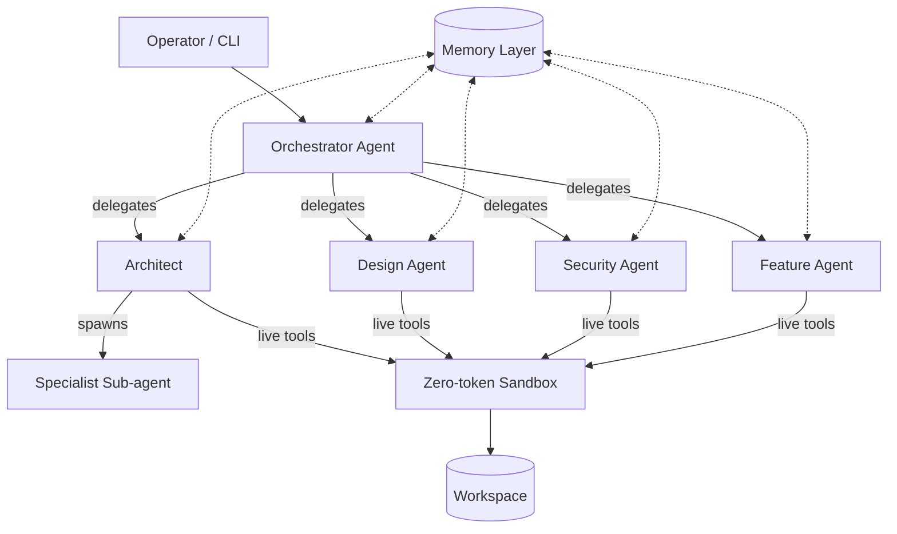

# SophronSwarm V3 — Project Overview

> A modular, token-optimized, multi-agent CLI for autonomous software engineering at the organization level.
> Evolved from V2's fixed bitmask pipeline into a dynamic, delegation-driven agent organization.

---

## 1. Vision

V3 keeps V2's core philosophy — **deterministic routing, zero-token execution, prompt-cache-ordered prompts, resilient retry** — and evolves the rigid fixed pipeline (Architect → Coder → Sandbox → Debugger → Reviewer) into a **dynamic organization of highly-specialized agents** that delegate work to each other, much like a real engineering org.

The guiding principle: **spend tokens only where an LLM's judgment is required.** Everything else — routing, file I/O, builds, tests, patching, context management — is deterministic machinery.



---

## 2. What V2 Taught Us

### Keep
- **Volatility-ordered prompts** (`PromptBuilder`) for maximum prefix-cache hits.
- **Transient-error retry** (`retry.py`: classify → backoff → HALT only on fatal).
- **On-demand workspace** (structural tree only; fetch file contents lazily).
- **Zero-token sandbox** (patch → build → test entirely in-process/Docker, no LLM calls).
- **Immutable SQLite checkpointer** + **JSONL event recorder** for debugging & rollback.
- **Infinite-loop protection** (`failure_streak`, `MAX_ITERATIONS`).

### Evolve
- **Bitmask → delegation.** The 16-bit mask was token-free but **rigid**: it encoded exactly 5 node types and 6 languages. An "organization of agents" needs *N* agents, *M* relationships, and runtime composition. V3 replaces central-bitmask routing with **agent-initiated delegation** (the model calls a `delegate` tool) while keeping a **declarative policy table** that says *which* delegations/tools are permitted. Routing cost stays near-zero (a dict lookup + policy check), but the topology is now unbounded and self-organizing.
- **Multi-iteration request→serve→act → single-turn live tools.** V2's #1 ROADMAP item: give agents native function-calling so they read/write/build/verify within **one** turn, collapsing 4–6 graph iterations into 1 and eliminating the `requested_files`/auto-stay loop class entirely.
- **Fixed 5 roles → composable specialist registry.** Agents are no longer hardcoded Python nodes; they are **declarative definitions** (markdown + frontmatter, à la Claude Code) loaded from disk and editable at runtime.

---

## 3. Reference Platform Analysis

| Platform | Core idea borrowed for V3 |
|---|---|
| **Claude Code** | Declarative subagents (`.md` + YAML frontmatter); per-subagent tool/model/permission scoping; **plan mode**; permission modes incl. **auto-mode classifier**; hooks as deterministic gates; adversarial verification subagent; context isolation (verbose output stays in subagent). |
| **OpenAI Codex** | **OS-level sandbox isolation** (Landlock/seccomp on Linux — your Ubuntu target); `AGENTS.md` convention; approval tiers (`suggest`/`auto-edit`/`full-auto`); containerized full-auto execution. |
| **SwarmClaw** | **Org-chart delegation** (CEO/CTO/…); durable hybrid memory + reflection; **MCP lazy-loading** (`alwaysExpose:false` + `mcp_tool_search` meta-tool — *critical* token saver); per-tool token-cost meter; `/compact` routed to a cheap model; **subagent concurrency caps + join policies + cycle detection**; dream cycles on cheap models; task board + scheduling; run handoff packets. |

### The single most important token lesson (from SwarmClaw)
Binding a chatty MCP server's 40 tools every turn costs *thousands* of tokens in tool-schema alone, every turn, for every agent. SwarmClaw's fix — expose **nothing** by default and give the agent a single `mcp_tool_search({query})` meta-tool that promotes only the tools it actually needs for that session — is the highest-leverage token optimization we can adopt. V3 will make lazy MCP loading the **default**, not an option.

---

## 4. Core Architecture

### 4.1 The Agent Model
An **agent** is a declarative unit with:
- A **system prompt** (the body of its definition file).
- A **tool allowlist** (`tools`) and denylist (`disallowedTools`).
- A **model** (concrete model id, e.g. `anthropic/claude-sonnet-4`) and a **provider** (configured instance name, e.g. `openrouter`) — both required, resolved via `resolveModel(model, provider)`. V3.1.0 removed tiers, `inherit`, and built-in defaults.
- A **permission mode** (`default` | `accept-edits` | `auto` | `plan` | `full-auto`).
- **MCP servers** scoped to it (lazy-loaded by default).
- **Memory scopes** it can read/write (per-agent, shared, task).
- A **delegate allowlist** — which other agent types it may spawn (prevents runaway org growth).

Agents live in `agents/` (project) or `~/.sophron/agents/` (user), as `*.md` files with YAML frontmatter — hot-reloaded at runtime, exactly like Claude Code.

### 4.2 The Execution Loop
```
while not done:
    response = agent.step()                    # one LLM call with tools
    for tool_call in response.tool_calls:
        result = ToolDispatcher.dispatch(tool_call)   # synchronous, in-turn
        # delegate / read_file / write_file / run_command / build / test / search_mcp …
    if response.terminal:                      # agent emitted final answer
        break
```
This is the **agentic loop** from Claude Code/SwarmClarm: the model decides the next action, tools execute immediately, and the agent terminates when it's satisfied. There is **no global bitmask router** — each agent owns its turn.

### 4.3 Delegation (the org layer)
- Any agent with the `delegate` tool can spawn a **sub-agent** in its own isolated context.
- A **declarative policy** constrains which agents may be delegated to (allowlist), a **concurrency cap** (default 4, hard cap 16), **join policy** (`all` | `first` | `quorum`), and **cycle detection** (walk parent ancestry before spawn).
- Delegation returns only a **summary** to the caller — the sub-agent's verbose tool output (logs, large file reads, build output) never pollutes the parent's context. This is the primary context-preservation mechanism.

### 5.4 The Zero-token Sandbox (decided: Landlock-primary, Docker opt-in)
V2's patch/build/test sandbox becomes a **tool backend** exposed to agents as live tools:
- `read_file`, `write_file`, `edit_file`, `list_dir`, `grep`, `glob`
- `apply_patch` (unified diff, with V2's robust Python applier + `-p1`/`-p0` POSIX fallbacks).
- `run_command` — executes **arbitrary** shell (not just V2's hardcoded language tables) under **OS-level isolation**, with the **dangerous-command blocker** gate (§5.6).

**Execution model (decided — see §5.4a for full rationale):**
- **Primary backend: Landlock + seccomp.** Each `run_command` cages the process to write only inside the workspace and restricts network to an allowlist. No daemon, no image pull, microsecond startup — runs natively on the Ubuntu host. This is what makes agent-driven autopilot practical.
- **Optional backend: Docker.** Available for stronger isolation (untrusted/heavy work, multi-language toolchains). Selected per-agent or per-command.

No LLM tokens are spent on execution.

### 5.4a Sandbox backends — Docker vs Landlock (explanation)

**What V2's sandbox did:** a dedicated graph node that (1) applied unified diffs to disk via a layered Python-applier → `patch -p1` → `patch -p0` chain; (2) ran *fixed, language-specific* build/test/install commands from hardcoded tables; (3) translated hardware exit codes directly into bitmask flags — **never** calling an LLM. Its execution backend was **Docker-primary with a raw-subprocess fallback**: spin a throwaway container from a per-language image (`python:3.11-slim`, `node:20-alpine`, …), bind-mount the workspace at `/workspace`, capture stdout/stderr; if the Docker daemon was unavailable, fall back to running the command directly on the host shell.

**Why Docker-primary is the wrong default for V3:**
- It only ever ran the *hardcoded* language commands — an agent **cannot** say "run `grep -r foo src/`" or "run `tsc --noEmit src/auth.ts`." That breaks the autopilot vision.
- Container startup + image pulls add seconds of latency per command and depend on a running daemon — friction for interactive, agent-driven work.
- The subprocess fallback runs **unsandboxed on the host**, which is dangerous under autopilot.

**Why Landlock-primary fits V3:**
- **Landlock** (Linux ≥5.13, present on the Ubuntu target) and **seccomp** are kernel features where a process *voluntarily cages itself*: "I may only write inside `<workspace>/`, I may only touch these network endpoints." There's no second OS, no image, no daemon — it's just syscalls on the agent's own process. This is how Codex and Claude Code's `/sandbox` get fast local isolation.
- It accepts **arbitrary** commands (the agent decides what to run), not a fixed table.
- Microsecond startup; no daemon dependency — ideal for the CLI/autopilot loop.
- Docker stays available as an **opt-in** for the rare case needing a full second OS or an untrusted toolchain image.

---

## 5. Feature Specifications

### 5.1 Agent Customization ✅ (refined)
**Spec.** Agents are markdown+frontmatter files. Add/remove = create/delete a file (hot-reloaded). Fully customizable: system prompt, `tools`, `model`, `permissionMode`, `mcpServers`, `memory` scopes, `delegate` allowlist, `maxTurns`. MCP access per §5.1b.

**Architect-creates-agents (decided policy):** Agent creation is a **one-time, project-bootstrap step**, not a continuous runtime capability. When a project starts, the **Architect** reads the requirements and produces the **full agent roster for that project** in a single pass (e.g. design/security/feature/… tailored to the work). These are written to `agents/` in a **`draft`** state and **all require explicit operator approval** before any of them can execute — there is no auto-approval path. After the roster is approved, agent creation is **closed** for the rest of the project (the org is fixed). Editing an existing agent's prompt/config at runtime stays allowed (hot-reload), but **adding new agent types** requires re-opening the bootstrap approval. This matches the user's intent: architects plan and create agents *once, up front, before anything else is created*, under human review.

### 5.1b MCP Access (specialized creation)
- Any MCP server (stdio / SSE / streamable-http) configurable globally and scoped per-agent.
- **Lazy by default** (`alwaysExpose: false`): agent gets a single `mcp_tool_search({query, limit})` meta-tool; tools are promoted into the session only when the agent asks.
- Per-tool **token-cost meter** (`chars / 3.5` estimate) surfaced in the UI so operators see the costliest servers before a run.
- Long-lived per-server connection pool (saves 100–500 ms × servers × turns).

### 5.2 Per-agent Critical Memory ✅ (refined)
**Spec.** Each agent has a private memory directory (`<memory_root>/<agent_id>/`) with a curated `MEMORY.md` (first ~200 lines auto-injected into its system prompt). Structured sections:
- **Past Points of Failure** — what broke and the fix.
- **Past Encountered Issues** — gotchas, env quirks, non-obvious behavior.
- **Key Points** — architecture decisions, library locations, conventions.

Writes happen via a `remember` tool the agent calls deliberately (not auto-dumped every turn — that bloats context). Quality-gated: a `reflectionMinQuality` threshold and optional embedding dedup skip low-value/near-duplicate notes (SwarmClaw pattern).

### 5.3 Shared Critical Memory ✅ (decided: file-based, in shared memory)
**Spec.** A shared, version-controllable memory store all agents read, implemented as **plain markdown files** under `<workspace>/.sophron/shared/` (no DB, no vector store — diffs cleanly in git, operator-editable, auto-injected by section):
- **Project Overview** (`OVERVIEW.md`) — high-level goal, stack, constraints.
- **Checkpoints** (`CHECKPOINTS.md`) — ordered list of project milestones.
- **Current Checkpoint** (`CURRENT_CHECKPOINT.md`) — the single active milestone (drives the orchestrator).

**Decision (Q2/Q3):** The *current checkpoint* lives in **shared memory as a file** (`CURRENT_CHECKPOINT.md`), not in the checkpointer state — so it survives across sessions, is human-readable/editable in the CLI, and version-controls naturally. Agents read the current checkpoint into context each turn; the orchestrator advances it (writes the next checkpoint, marks the prior complete) on checkpoint completion, which is itself an approvable action.

### 5.4 Task-Specific Memory ✅ (refined — the key token saver)
**Spec.** A sub-agent's **conversation transcript is its task memory** and is **ephemeral** — it dies with the task. Only what the sub-agent explicitly promotes (via `remember` to per-agent memory, or a structured handoff packet to its caller) survives. This is what keeps per-task context small: nothing unrelated leaks in, and nothing expensive leaks out.

When a task needs critical info, the sub-agent writes it to **shared memory** (§5.3) so the next agent picks it up without re-deriving it. Handoff packets (objective, files touched, commands run, outcome, next-actions) — à la SwarmClaw — let work move between agents/sessions without replaying full transcripts.

### 5.5 Optimized UI/CLI Navigation ✅ (refined — rewritten for the two-tier hierarchy)
Two surfaces, one data model. **CLI-first** (locked, §7.6):
- **CLI/TUI (primary):** a tabbed terminal shell with **two chrome modes**:
  - **Boxed chrome** (dashboards) — "SophronSwarm" ASCII header, horizontal divider, tab bar, breadcrumb, content, and input bar. Used for Overview, Projects, Status, Agents list, Agent detail, Runs, Checkpoint, Memory, and Cost.
  - **Bare chrome** (chat views) — single-line status header, full-height content, input bar, no box border, no tab bar. Used for the **Home › Orchestrator** global chat and (V3.1.0-M4) per-agent **Agent channel**.
  Navigation uses ←/→ for tabs, ↑/↓ for lists, Enter to drill in, Esc to exit, and any printable char to focus the input bar. The nav state machine lives in `src/tui/nav.ts`.
- **Slash commands:** context-aware commands include `/projects`, `/agents`, `/runs`, `/checkpoint`, `/advance`, `/cost`, `/memory`, `/run`, `/approve`, `/rewind`, `/clear`, `/help`, `/quit`, and **`/model [agent] <model-id>`** (V3.1.0-M3) to change an agent's model at runtime and persist it to its `.md` frontmatter.
- **Web UI** (V2's debug server, promoted): org-chart view of agents + delegation, live run replay, memory browser, approvals desk, token/cost dashboard. Shares the JSONL event log with the CLI. **Deferred** (M9) — CLI-first is locked.

Both let the operator **interfere/customize** at any point: edit an agent mid-run, inject a checkpoint, force-approve a command, rewind to a prior state (checkpointer), or change an agent's model via `/model`.

### 5.6 Computer Access + Bash Autopilot ✅ (refined)
**Spec.** Agents with permission (architect, dependency-manager, builder, …) can run shell commands via `run_command`, executed under **OS-level isolation**:
- **Linux (primary, Ubuntu):** Landlock + seccomp sandbox restricting filesystem writes to the workspace and network to an allowlist.
- **Dangerous-command blocker (mycannybird-style):** a deterministic pre-execution gate classifies every command against (a) a blocklist (`rm -rf /`, `:(){:|:&};:`, `dd of=/dev/`, `mkfs`, `chmod -R 777 /`, force-push to protected branches, etc.) and (b) pattern heuristics (recursive deletes outside workspace, writes to `.`-config dirs, network exfiltration). Blocked commands return an error to the agent; **escalation** routes to the operator.
- **Permission modes:** `default` (prompt), `accept-edits` (auto file edits), `auto` (a **cheap classifier model** vets each command — Claude Code's auto-mode), `plan` (read-only), `full-auto` (sandboxed, no prompts).

### 5.7 Highly Specialized (Atomic) Agents ✅ (refined)
**Spec.** The platform ships **starter kits** — pre-built, narrow agents for common domains — and treats them as the unit of composition (SwarmClaw's "mix and match" pattern). Examples for a website project:
- **Design Agent** — MCP-linked UI/design skill (e.g. a Figma MCP or design-system MCP); read+write files; no shell.
- **Security/Auth Agent** — security-review MCP; read-only + `run_command` for static analysis; plan mode default.
- **Feature Agent** — general builder; full tool set under `auto` permission.
- **Orchestrator/Architect** — delegates only; frontier model; can `propose_agent`.

Specialization = *small tool set + focused prompt + scoped MCP + appropriate model*. Atomicity is enforced by the tool/permission model, not just the prompt.

---

## 6. Token Optimization Strategy (consolidated)

| # | Technique | Source | Impact |
|---|---|---|---|
| 1 | Native function calling (live tools, single-turn) | V2 ROADMAP | **~50–70%** fewer LLM calls |
| 2 | Subagent context isolation (verbose output stays out of parent) | Claude Code | Prevents context bloat |
| 3 | MCP lazy-loading (`mcp_tool_search`, `alwaysExpose:false`) | SwarmClaw | **Thousands** of tokens/turn |
| 4 | Per-agent model routing (cheap for explore/compact, frontier for arch) | Claude Code/SwarmClaw | Major cost cut |
| 5 | Volatility-ordered prompts (prefix-cache hits) | V2 | Cache discount on every call |
| 6 | Task-specific ephemeral memory (no cross-task leakage) | V3 design | Smaller per-turn context |
| 7 | Context meter + `/compact` routed to cheap model | SwarmClaw | Extends sessions cheaply |
| 8 | Quality-gated, deduped reflection memory | SwarmClaw | No low-value writes |
| 9 | Background consolidation ("dream") on cheap/local model | SwarmClaw | Free-ish memory upkeep |
| 10 | On-demand workspace (structural tree, fetch-on-read) | V2 | No gratuitous file tokens |

---

## 7. Critical Feedback — What to Reconsider

### 7.1 ⚠️ "Architects create agents" — add guardrails
Unbounded, self-promoted agent creation is the fastest way to an **uncontrollable, expensive, self-modifying swarm**. Keep the capability but require **draft → approval** with a safe auto-approval policy (§5.1). Never let an agent silently grant itself `full-auto` or a broader tool set. (Claude Code writes agent files but a human effectively curates them; SwarmClaw keeps conversation-to-skill as a *draft*, never auto-promoted.)

### 7.2 ⚠️ Drop the central bitmask as the *coordination* mechanism — keep it only for the *sandbox*
V2's bitmask was elegant but it's the wrong abstraction for a dynamic org: you can't encode N agents and M delegation edges in 16 bits without constant renumbering, and every new agent requires a routing-table edit. **Delegation + a declarative policy table** is strictly more expressive at near-zero cost. *However*, keep a compact bitmask **internally for the sandbox** (language/action/status), since that interface is stable and token-free.

### 7.3 ⚠️ "Task-specific memory" only saves tokens if you're disciplined
The idea is right, but it becomes overhead if every task logs a transcript you then have to manage. Make ephemeral transcripts **die by default**, and promote only via explicit `remember` / handoff packets. Don't build a task-memory *store* that grows forever — that's just a second context window you pay to maintain.

### 7.4 ⚠️ Be wary of MCP token sprawl — it's the silent budget killer
Your "specialized agents with MCP access" vision is exactly where token costs explode (a Playwright/Figma MCP can be 40+ tools). Adopt SwarmClaw's lazy default from day one; surface the per-tool cost meter early. Do **not** bind all configured MCP tools into every agent's system prompt.

### 7.5 ✅ Keep "shared critical memory" simple and file-based
Resist the urge to build a vector DB / graph memory for V3. Markdown files under `.sophron/shared/` that diff in git and get auto-injected by section are simpler, cheaper, inspectable, and operator-editable. Add embeddings/dedup **only** for the per-agent reflection store, and only once volume justifies it.

### 7.6 ✅ CLI-first, web-second (matches your reference set)
Codex and Claude Code are CLI-first; SwarmClaw is web-first. Given your goals (interfere/customize, developer workflow), **CLI-first with a promoted debug web UI** is the right call — don't sink V3's early budget into an Electron dashboard.

---

## 8. Phasing + milestones

The original phase breakdown (0–7) is **complete through Phase 6**. Subsequent
work is tracked as **milestones M1–M10** in [`ROADMAP.md`](./ROADMAP.md), which
is the authoritative current plan. **M1–M8 + M10 are complete** (665/665 tests);
**M9 (web UI)** is deferred (CLI-first is locked). Summary:

| Phase / Milestone | Deliverable | Status |
|---|---|---|
| **0 — Skeleton** | Agentic loop + tool dispatcher + declarative agent loader + checkpointer/recorder. | ✅ [COMPLETE](PHASE_0_COMPLETE.md) |
| **1 — Live tools + sandbox** | `run_command` / `apply_patch` under bubblewrap + dangerous-command blocker. | ✅ [COMPLETE](PHASE_1_COMPLETE.md) |
| **2 — Delegation** | `delegate` tool, depth limit, cycle detection, allowlist, isolated context, HandoffPacket, recorder stack. | ✅ [COMPLETE](PHASE_2_COMPLETE.md) |
| **3 — Memory** | Per-agent (`MEMORY.md` + `remember`), shared (`.sophron/shared/`), handoff packets to shared memory. | ✅ [COMPLETE](PHASE_3_COMPLETE.md) |
| **4 — MCP** | Lazy loader + `mcp_tool_search` + token-cost meter + connection pool. | ✅ [COMPLETE](PHASE_4_COMPLETE.md) |
| **5a — CLI/TUI** | Ink TUI panels, slash-commands, approvals desk. | ✅ [COMPLETE](PHASE_5_COMPLETE.md) |
| **6 — Auto mode + agent-creation** | Classifier-based auto permission; `propose_agent` draft→approve. | ✅ [COMPLETE](PHASE_6_COMPLETE.md) |
| **M1 — Output Purifier** | Deterministic + Tier-2 cheap-model filter on tool output. | ✅ DONE |
| **M2 — Named Providers** | Free-form provider-instance names; multi-endpoint. | ✅ DONE |
| **M3 — TUI Shell (rewrite)** | Box-chrome tabbed Home + Project View; live-stream agent detail; pure nav reducer. | ✅ DONE |
| **M4 — Context `/help`** | `helpForView(view)` over M3's view set. | ✅ DONE |
| **M5 — `sophron init` Templates** | Scaffolds a project + seeds the standardized per-project orchestrator + global architect. | ✅ DONE |
| **M6 — `propose_roster`** | Batch draft→approve→close; generalizes `propose_agent`. | ✅ DONE |
| **M7 — Global Orchestrator meta-layer** | The "CEO" agent above all projects (no memory); `propose_project` / `init_project`. | ✅ DONE |
| **M8 — Wire Global Orchestrator into Home** | Real global-orchestrator chat in Home › Orchestrator tab. | ✅ DONE |
| **M9 — Web UI (Phase 5b)** | Promote V2 debug UI to Next.js. | ⏸ Deferred |
| **M10 — Operator Ergonomics** | `add-provider`/`edit-provider`/`remove-provider`; `sophron projects` mgmt; model-aware architect. | ✅ DONE |
| **V3.1.0-M1 — Provider + Model Refactor** | Removed tiers/defaults/`inherit`; `model:`+`provider:` required; added provider `description`. | ✅ DONE |
| **V3.1.0-M2 — G_O Consolidation** | Remove architect; G_O designs rosters inline via `propose_roster`. | ✅ DONE |
| **V3.1.0-M3 — Chrome Layering + `/model`** | Bare chrome for chat views; `/model` slash command (persists to disk). | ✅ DONE |
| **V3.1.0-M4 — Agent Channels** | Live stream + interrupt + interactive chat per agent. | 🔜 Next |
| **V3.1.0-M5 — CLI + Wizard + Polish** | Provider commands consolidated; `sophron init` provider wizard. | 🔜 |

---

## 9. Decisions Log

1. **Provider scope (decided — Q1):** Ship V3 with three providers — **OpenRouter** (cloud router), **Ollama** (local, offline), and **z.ai** (OpenAI-compatible endpoint `https://api.z.ai/api/coding/paas/v4`). All three are OpenAI-compatible → one LLM client.
2. **Sandbox backend (decided — Q2 + your follow-up):** **Landlock/namespace isolation primary** (bubblewrap on Linux; optional ~200-line Rust helper for finer Landlock rules), Docker opt-in. See §5.4a for the full Docker-vs-Landlock explanation.
3. **Current-checkpoint location (decided — Q3):** A file in shared memory (`<workspace>/.sophron/shared/CURRENT_CHECKPOINT.md`). Not a checkpointer field.
4. **Agent-creation policy (decided — Q4):** One-time, project-bootstrap step. Architect drafts the **entire** roster up front; **all** drafts require explicit operator approval; creation is then closed for the project. **Soft cap at 12 agents** per workspace (warn, don't hard-block). See §5.1.
5. **Auto-mode classifier (decided):** a **small local Ollama model** for per-command vetting (free, offline, low-latency). Model name TBD when you pick one.
6. **Language/stack (decided — Q4 follow-up):** **TypeScript** primary + small sandbox helper (bubblewrap primary, optional Rust Landlock helper, Docker opt-in). V2 (Python) becomes the reference spec; logic ports 1:1. See §10 for the full stack.
7. **Sandbox backend (clarified 2026-07-07):** **bubblewrap (bwrap) primary** — Landlock securityfs is not mounted on this host, so bubblewrap namespace isolation is the actual primary (the §5.4 / decision #2 text predates that finding). Docker stays opt-in; host backend gated behind `SOPHRON_ALLOW_HOST_BACKEND=1`.
8. **Two-tier hierarchy (decided 2026-07-07):** SophronSwarm is multi-project. There is one **global orchestrator** above all projects (the operator's "CEO", at `~/.sophron/`) plus a **per-project orchestrator** seeded into each project's `agents/` by `sophron init`. The global orchestrator proposes/creates projects; the per-project orchestrator runs each project's work. See `ROADMAP.md` (vision) + `IDEAS.md` §6.
9. **Global orchestrator has NO memory (decided 2026-07-07):** It reads the project registry (`~/.sophron/projects.json`) and the current chat thread — nothing else. No per-agent `MEMORY.md`, no shared-memory injection. It must not inherit or interfere with any project's memory. Tool set is scoped: `delegate`, `list_projects`, `propose_project`, `init_project`, read-only file tools over `~/.sophron/`. **No** `run_command` / `apply_patch`.
10. **Standardized per-project orchestrator = a copy (decided 2026-07-07):** `sophron init` / project creation seeds an identical `orchestrator.md` into every project's `agents/`. Each copy is independently editable and carries its own per-project memory.
11. **Project location (decided 2026-07-07):** New projects are created at `~/sophron_workspace/<name>` and registered in `~/.sophron/projects.json`.
12. **No tiers / no defaults (decided 2026-07-12, V3.1.0-M1):** The entire tier system (`ModelTier` type, `modelTier` field, `tiers` config, tier-resolution logic) is **removed**. Every agent requires a concrete `model:` id + a `provider:` name. No built-in provider defaults, no `defaultModel`, no `inherit`, no prefix shortcuts. `resolveModel(model, provider)` is the single chokepoint. Rationale: frontier AI models constantly change; a fixed mapping is stale on arrival.
13. **Provider descriptions (decided 2026-07-12, V3.1.0-M1):** Provider instances carry a `description` field (first-class) so the architect/G_O can understand what each provider is good for when designing rosters.
14. **G_O absorbs architect (decided 2026-07-12, V3.1.0-M2):** The separate architect agent is **removed entirely**. The global orchestrator designs architectures and drafts rosters inline via `propose_roster` (full conversation context). No `delegate` tool on the G_O. Rationale: the G_O has full context; a second model = configuration mess + information loss.

## 10. Technology Stack (decided)

### Decision: TypeScript primary + small sandbox helper

V2 was Python. For V3's stated priorities (**strong front-end + speed**, multi-agent org with a dashboard, MCP-centric, CLI-first), **TypeScript is a better fit than Python.** This mirrors SwarmClaw (the closest analog: TS 95.6%, same product shape). Claude Code and Codex use Rust because they're massive-scale, single-agent-first tools — not V3's shape.

| | Python (V2) | **TypeScript (rec.)** | Rust |
|---|---|---|---|
| Front-end | Weak (split UI) | **One language: CLI+TUI+web+desktop** | Weak (split UI) |
| Startup speed | ~150–300 ms | ~30–50 ms (Node), ~10 ms (Bun) | **~5 ms** |
| Dev velocity | High | High | Low |
| MCP SDK | Secondary | **First-class (official)** | Immature |
| V2 reuse | Direct | Port logic, not code | Port logic, not code |
| Proven analog | V2 itself | **SwarmClaw** | Claude Code, Codex |

**Sandbox in a TS world (keeps the Landlock goal):**
- **Primary: `bubblewrap` (bwrap)** — mature Linux namespace sandbox, already on most Ubuntu installs (Flatpak), zero code: `bwrap --unshare-net --bind <workspace> /workspace -- <cmd>`. Plus a TS-side dangerous-command blocklist.
- **Optional (finer rules): ~200-line Rust helper** (`sophron-sandbox`) using `landlock` + `libseccomp` crates, spawned as a child process.
- **Docker:** opt-in backend (as decided §5.4).

**Proposed stack:**
- Runtime: **Node.js 22+** (Bun optional for max startup speed)
- Language: **TypeScript**, strict
- CLI/TUI: **Ink** (React-for-terminals)
- Web UI: **Next.js + React** (promoted from V2's debug server)
- Checkpointer DB: **better-sqlite3** (WAL, sync, fast — same as SwarmClaw)
- MCP: **@modelcontextprotocol/sdk**
- LLM client: **OpenAI SDK** (OpenRouter / Ollama / z.ai all OpenAI-compatible → one client)
- Sandbox: bubblewrap primary, Rust helper optional, Docker opt-in
- Desktop (much later): **Tauri** (Rust shell + TS web UI — tiny vs Electron)

**V2 port strategy:** V2 becomes the *reference spec*, not a dependency. Port logic 1:1 — retry/transient classifier, prompt-builder volatility ordering, workspace lazy-fetch + path guard, patch applier (Python→`patch -p1`→`-p0`), log purifier, SQLite checkpointer (→ better-sqlite3), JSONL recorder.

**Caveat:** If TS is a major learning curve for the builder, staying in Python (with a separate TS web UI, like V2) is a defensible fallback — but loses the "one language everywhere" advantage that's the whole point of switching.

---

## 11. Remaining Open Questions

1. ~~**Ollama classifier model name**~~ — **RESOLVED (Phase 6):** `qwen3.5:9b-fast` on the `ollama` provider vets each mutating command (also reused by the purifier's Tier 2).
2. **Default permission mode for the bootstrap-approved agents** — `default` (prompt) for the cautious start, or `accept-edits` to reduce friction?
3. **Should the global orchestrator's chat history persist across sessions?** — it has no memory tier, but the Orchestrator-tab conversation list implies persistence. (Recommend: persist chat threads, but do NOT inject them as "memory".)
4. **Health-check definitions for the Home Overview** — recommend concrete signals: failed/stuck runs, pending approvals older than N, token-budget breaches, agents in HALT.

All major architectural and stack decisions are now locked (see §9, items 1–14). Phases 0–6 + milestones M1–M8 + M10 + V3.1.0-M1 complete (647/647 tests); M9 (web UI) deferred. See [`V3.1.0_PLAN.md`](./V3.1.0_PLAN.md) for the V3.1.0 milestone plan and [`ROADMAP.md`](./ROADMAP.md) for the full milestone history.
